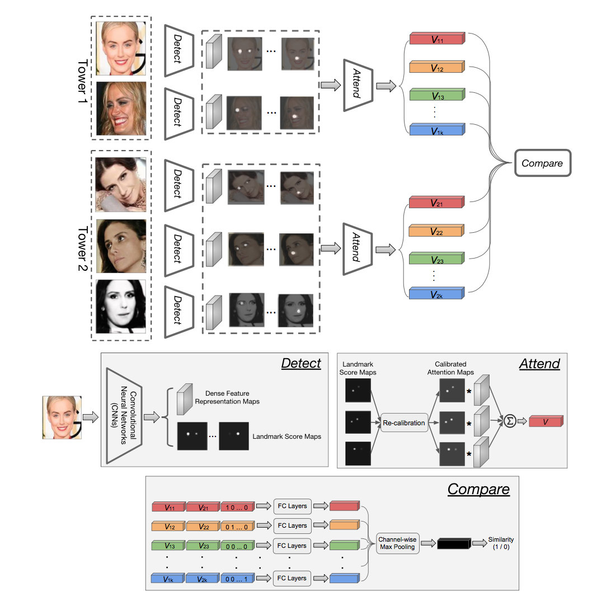

# ComparatorNetwork_PyTorch
This repo implements VGG's Comparator Network [1] using pytorch 0.4.0.  
This is not an official one.  
Overall architecture is below.  
</img>

## Dependencies

- Python 3.5+
- PyTorch 0.4.0
- python-opencv

## Implemented Part
- Basic architecture of detect, attend and compare module.
- Model train and test code.
- Diversity Regularization of local landmarks.
- Hard sampling.

## Currently ongoing part
- Using pretrained ResNet, SENet model in detect process.
- Keypoint Regularization of local landmarks.
- IARPA Janus benchmark test.

## Dataset  
Download VGGFace2 dataset [[link]](https://www.robots.ox.ac.uk/~vgg/data/vgg_face2/)  

## Train  
`python train.py -i "path to your local VGGFace2 train img dir"`  

## Test  
`python test.py -a "path to imgA" -b "path to imgB"`  

## References  
1. Weidi Xie, Li Shen, Andrew Zisserman, Comparator Networks, 2018 [[pdf]](https://arxiv.org/pdf/1807.11440.pdf)    
